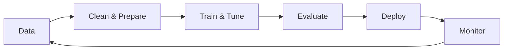

<div align="center">


<br>

### 🚀 Building Intelligent Systems | ML • DL • NLP • Computer Vision

<br>


<br>


</div>

<hr>

## 🎯 About Me

> An aspiring **AI Engineer** passionate about building practical, reliable, and well-engineered intelligent systems.

I'm focused on the **complete machine learning lifecycle**—from data exploration and feature engineering through model deployment and monitoring. I'm committed to writing clean, readable code and building systems that are both useful and maintainable.

**What drives me:**
- 🔬 Exploring cutting-edge AI/ML techniques and their practical applications
- 🛠️ Building reproducible, production-ready systems
- 📊 Data-driven problem solving with interpretability in mind
- 🤝 Collaborating on open-source and research initiatives
- 🎓 Continuous learning across emerging AI domains

<hr>

## 🛠️ Technical Arsenal

<div align="center">

### 💻 Core Technologies


<br>

### 🔧 Engineering & DevOps


</div>

### 📚 Expertise Matrix

| 🧠 **Machine Learning** | 🎨 **Deep Learning** | 📝 **NLP** | 🖼️ **Computer Vision** | ⚙️ **Engineering** |
|:---:|:---:|:---:|:---:|:---:|
| Model Development | Neural Networks | Text Analysis | Image Classification | Python Development |
| Feature Engineering | CNN/RNN | Language Models | Object Detection | Automation & Scripting |
| Data Analysis | Transfer Learning | NLP Pipelines | Image Segmentation | Docker & Containerization |
| Hyperparameter Tuning | Representation Learning | Transformers | Image Processing | Git & Version Control |

<hr>

## 🏗️ System Architecture & Data Flow



### 🔄 ML Workflow Cycle

Data → Feature Engineering → Model Training → Evaluation → Deployment → Monitoring

<hr>

## 📂 Project Architecture

- Data & Feature Engineering
- Model Development & Experimentation
- Deployment & Monitoring
- Documentation & Research Notes

```text
AI/ML Workspace
├── datasets/
├── preprocessing/
├── models/
├── api/
├── notebooks/
└── docs/
```

<hr>

## 🎯 Featured Projects

| Project | Description | Tech Stack | Link |
|---------|-------------|-----------|------|
| **Awesome NLP Toolkit** | 🗣️ Comprehensive NLP tools for text analysis and language understanding | Python, NLTK, spaCy, Transformers | [→ Repository](https://github.com/Dostugir/awesome-nlp-toolkit) |
| **DeepVision** | 🖼️ Advanced image classification using convolutional neural networks | Python, TensorFlow, Keras, OpenCV | [→ Repository](https://github.com/Dostugir/deepvision) |

<hr>

## 📈 Learning & Growth Path

<div align="center">

### 🚀 Current Focus Areas

</div>

- Production ML Systems → MLOps & Deployment
- Model Interpretability → SHAP, LIME, Attention
- Large Language Models → Fine-tuning & RAG
- Software Architecture → Design Patterns
- Advanced Deep Learning → Vision Transformers

<hr>

## 📊 GitHub Activity & Contributions

<div align="center">

### 🔥 Contribution Streak


<br>

### 📈 GitHub Stats


<br>

### 🎓 Top Languages


</div>

<hr>

## 🤝 Collaborators & Contributors

<div align="center">

### 👥 Join the Journey


*Made with [contrib.rocks](https://contrib.rocks)*

</div>

<hr>

## 🎨 Skill Level Overview

<div align="center">

### Proficiency Matrix

| Skill | Level | Status |
|-------|-------|--------|
| **Python** | ⭐⭐⭐⭐⭐ | Expert |
| **TensorFlow / PyTorch** | ⭐⭐⭐⭐ | Advanced |
| **Machine Learning** | ⭐⭐⭐⭐ | Advanced |
| **Deep Learning** | ⭐⭐⭐⭐ | Advanced |
| **NLP** | ⭐⭐⭐⭐ | Advanced |
| **Computer Vision** | ⭐⭐⭐⭐ | Advanced |
| **Docker & DevOps** | ⭐⭐⭐ | Intermediate |
| **MLOps** | ⭐⭐⭐ | Intermediate |

</div>

<hr>

## 📞 Let's Connect

<div align="center">

### 🌐 Get in Touch

I'm always excited to discuss AI, machine learning, open-source projects, or collaboration opportunities!

<br>

[](mailto:dostugir2002@gmail.com)
[](https://www.linkedin.com/in/abdullahazizdostugir)
[](https://github.com/Dostugir)

</div>

<hr>

<div align="center">

### 🌟 Philosophy

```
Always Learning. Always Building. Always Growing
```

**Open to:** 🤝 Collaboration | 🔬 Research | 💡 Innovative Ideas | 🚀 Ambitious Projects

**Last Updated:** 2026 | **Status:** 🟢 Active Development

<br>


</div>
